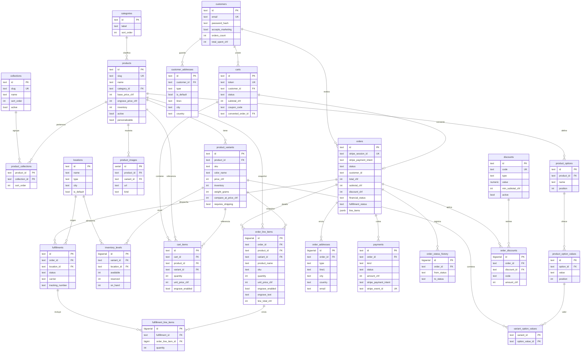

# Modelo Entidad-Relación · Ofelia Vallejo Leather House

> Diseño del modelo de datos completo del e-commerce (catálogo → carrito → checkout → pedido → inventario → cliente), inspirado en el modelo de comercio canónico de **Shopify** y adaptado al tamaño real de esta Leather House: **mono-moneda CHF**, un atelier en **Medellín**, sin multi-tienda.
>
> - **Baseline (migración 001):** `database/schema.sql`
> - **Evolución (migración 002):** `database/migrations/002_full_commerce_model.sql` — aditiva, idempotente, NO destructiva.
> - **Capa de acceso:** `lib/postgres.js`
>
> **Convención de dinero:** `INTEGER` en **CHF enteros** (francos), igual que el código actual (`base_price_chf`, `total_chf`, `price_chf`). Stripe recibe céntimos (`× 100`) en `lib/build-stripe-lines.js`. Solo los **porcentajes** de descuento usan `NUMERIC`.

---

## 1 · Modelo actual (antes de la migración 002)

Tablas existentes en `database/schema.sql`:

| Tabla | Propósito | Notas |
|---|---|---|
| `categories` | Taxonomía primaria (Mujer/Guanábana, Hombre/Borojó…) | PK `id TEXT` |
| `products` | Producto del catálogo | PK `id TEXT`, `slug` único, precios CHF en `INT`, `inventory INT`, mucho JSONB (`engrave`, `color_data`, `accordion`, `specs`, `meta`) |
| `product_variants` | Variante = **color de cuero** | PK `id TEXT`, FK `product_id`, `sku`, `inventory INT`, `price_chf INT` opcional |
| `product_images` | Galería por producto/variante | PK `SERIAL`, `kind` (hero/gallery) |
| `orders` | Pedido | PK `id TEXT`, `stripe_session_id` único, `status`, `customer_id`, `total_chf INT`, **`line_items JSONB`**, `engrave_config JSONB` |
| `order_events` | Log crudo de eventos (Stripe) | idempotencia vía `payload->>'stripe_event_id'` |
| `customers` | Cuenta de cliente (JWT) | `email` único, `password_hash` |
| `personalization_requests` | Solicitudes de grabado (canal email) | `ref` único |
| `newsletter_subscribers` | Lista de correo + cupón lanzamiento | `coupon_code` default `OV-TEMPORADA` |

**Flujo actual:** el carrito es **client-side** (`assets/js/cart.js` + `localStorage`). `api/checkout/create.js` arma las líneas con `lib/build-stripe-lines.js`, crea la sesión Stripe y persiste el pedido con `createOrder()` (líneas en JSONB). El webhook (`api/checkout/webhook.js`) marca `paid`, descuenta inventario con `decrementInventory()` (sobre `product_variants.inventory` / `products.inventory`) y registra el evento. El historial del cliente sale de `getOrdersByCustomer()`.

**Limitaciones que resuelve la 002:** sin líneas de pedido normalizadas (solo JSONB), sin direcciones (cliente ni snapshot de pedido), sin transacciones de pago como entidad, sin ubicaciones/niveles de inventario, sin opciones de variante normalizadas, sin colecciones editoriales como entidad, sin cupones como entidad, sin carrito persistente, sin historial de estado ni envíos.

---

## 2 · Modelo nuevo (tras la migración 002)

### Entidades añadidas

| Bloque | Tablas nuevas | Extensiones a tablas existentes |
|---|---|---|
| Catálogo | `collections`, `product_collections`, `product_options`, `product_option_values`, `variant_option_values` | `product_variants` (+`barcode`, `weight_grams`, `compare_at_price_chf`, `requires_shipping`, `active`, `created_at`, `updated_at`) |
| Inventario | `locations`, `inventory_levels` | — |
| Clientes | `customer_addresses` | `customers` (+`accepts_marketing`, `default_address_id`, `last_login_at`, `orders_count`, `total_spent_chf`) |
| Carrito | `carts`, `cart_items` | — |
| Ventas | `order_line_items`, `order_addresses`, `order_status_history` | `orders` (+`subtotal_chf`, `discount_chf`, `shipping_chf`, `tax_chf`, `financial_status`, `fulfillment_status`, `coupon_code`, `cart_id`) |
| Pagos | `payments` | — |
| Logística | `fulfillments`, `fulfillment_line_items` | — |
| Descuentos | `discounts`, `order_discounts` | — |

---

## 3 · Diagrama ER (Mermaid)



---

## 4 · Tabla por entidad (campos clave y propósito)

### Catálogo

**`collections`** — Colecciones editoriales de marca (Guanábana, Borojó, Uchuva, Chontaduro, Curuba). `slug` único para rutas; `sort_order`, `active`. Many-to-many con productos vía `product_collections` (un producto puede figurar en varias colecciones). `categories` sigue siendo la taxonomía primaria 1-a-muchos.

**`product_options` / `product_option_values`** — Ejes de variación normalizados. Hoy implícitos: **Color** (Negro, Rústico, Café Oscuro, Espresso, Vino, Verde), **Tamaño** (`v-standard`/`v-grande`), **Línea** (`v-mod`/`v-clasica`/`v-elite`). `position` ordena la presentación.

**`variant_option_values`** — Puente que mapea cada `product_variants` a su combinación de valores de opción (p.ej. variante `v-negro` ↔ valor «Negro» de la opción «Color»). PK compuesta.

**`product_variants` (extendida)** — Se añaden `barcode`, `weight_grams` (peso para envío), `compare_at_price_chf` (precio tachado), `requires_shipping`, `active`, `created_at/updated_at`. No se toca `inventory`/`price_chf` existentes.

### Inventario

**`locations`** — Ubicaciones físicas. Semilla: `loc-medellin` (Atelier Medellín, `is_default = true`). Tipos: atelier/warehouse/retail.

**`inventory_levels`** — Stock por **variante × ubicación**: `available`, `reserved`, `on_hand` (todos `CHECK >= 0`), `UNIQUE(variant_id, location_id)`. Es la capa normalizada destino del inventario. **Coexistencia:** hoy el stock real vive en `product_variants.inventory` y el webhook descuenta ahí; `inventory_levels` queda lista para el corte (ver §7 Próximos pasos).

### Clientes

**`customers` (extendida)** — Se añaden `accepts_marketing`, `default_address_id`, `last_login_at`, `orders_count`, `total_spent_chf` (métricas tipo Shopify Customer).

**`customer_addresses`** — Libreta de direcciones del cliente (`type` = shipping/billing, `is_default`). País por defecto `CH` (mercado europeo).

### Carrito

**`carts` / `cart_items`** — Carrito **persistente opcional** para abandono/recuperación/multi-dispositivo. `token` sincronizable con el id de `localStorage`; `status` = active/converted/abandoned; `converted_order_id` enlaza al pedido resultante. **No reemplaza** el carrito client-side actual.

### Ventas / Pedidos

**`orders` (extendida)** — Desgloses `subtotal_chf`, `discount_chf`, `shipping_chf`, `tax_chf`; estados separados estilo Shopify: `financial_status` (pending/paid/refunded/voided) y `fulfillment_status` (unfulfilled/partial/fulfilled); `coupon_code`, `cart_id`. La columna `line_items JSONB` y `status` originales se conservan intactas (el webhook sigue funcionando).

**`order_line_items`** — Líneas normalizadas. FKs `product_id`/`variant_id` con `ON DELETE SET NULL` + **columnas snapshot** (`slug`, `product_name`, `variant_label`, `sku`, `unit_price_chf`) para que el historial sobreviva al borrado de catálogo. **Grabado a nivel de línea**: `engrave_enabled`, `engrave_text`, `engrave_font`, `engrave_size`, `engrave_layout`, `engrave_price_chf`. `line_total_chf` = `(unit_price + engrave_price) × quantity`.

**`order_addresses`** — Snapshot inmutable de la dirección de envío/facturación al momento de compra. `UNIQUE(order_id, type)`.

**`order_status_history`** — Transiciones de estado de negocio (`from_status` → `to_status`, `note`). Complementa el log crudo `order_events`.

### Pagos

**`payments`** — Transacciones Stripe (`kind` = charge/refund/authorization, `status`, `amount_chf`, `stripe_session_id`, `stripe_payment_intent`). `stripe_event_id UNIQUE` formaliza la **idempotencia** del webhook (hoy en `order_events.payload`).

### Logística

**`fulfillments` / `fulfillment_line_items`** — Envíos: `location_id` de origen, `carrier`, `tracking_number`, `tracking_url`, `shipped_at`, `delivered_at`. Cada cumplimiento detalla qué líneas y cantidades despacha.

### Descuentos

**`discounts`** — Cupones: `code` único, `type` (percentage/fixed_amount), `value NUMERIC`, `min_subtotal_chf`, vigencia (`starts_at`/`ends_at`), `usage_limit`/`used_count`, `once_per_customer`. Semilla: `OV-TEMPORADA` (10%). **`order_discounts`** — Aplicación por pedido con snapshot de `code` e `amount_chf`.

---

## 5 · Flujo de datos de punta a punta

```
CATÁLOGO            categories / collections → products → product_variants (+options) → product_images
   │                                              │
   │ navegación PDP                               │ stock: inventory_levels (variante × location)
   ▼                                              ▼
CARRITO          assets/js/cart.js (localStorage)  ──opcional──▶  carts / cart_items
   │                                                                     │
   │ POST /api/checkout/create                                           │
   ▼                                                                     │
CHECKOUT (Stripe)  build-stripe-lines.js arma líneas + total CHF ◀───────┘
   │               crea Checkout Session · createOrder() persiste el pedido (line_items JSONB)
   │               [nuevo] order_line_items + order_addresses + payments(pending) + order_discounts
   ▼
WEBHOOK            POST /api/checkout/webhook  (idempotente por stripe_event_id)
   │               financial_status = paid · payments(paid) · order_status_history(pending→paid)
   ▼
INVENTARIO         decrementInventory() por cada línea (variante/cantidad)
   │               [destino] inventory_levels.available -= qty en loc-medellin
   ▼
CUMPLIMIENTO       fulfillments + fulfillment_line_items · fulfillment_status
   ▼
CLIENTE            getOrdersByCustomer() · orders.customer_id · orders_count / total_spent_chf
```

---

## 6 · Inspiración Shopify → equivalente en este proyecto

| Concepto Shopify | Equivalente aquí | Notas de adaptación |
|---|---|---|
| `Product` | `products` | Igual. Mantiene JSONB de copy/ficha. |
| `ProductVariant` | `product_variants` | Variante = color de cuero (+ opciones normalizadas). |
| `ProductOption` / `OptionValue` | `product_options` / `product_option_values` / `variant_option_values` | Color, Tamaño, Línea. |
| `Collection` | `collections` + `product_collections` | Colecciones editoriales paisas (Guanábana…). `categories` queda como taxonomía primaria. |
| `Media` / `Image` | `product_images` | Igual (baseline). |
| `InventoryItem` | `product_variants` (rol implícito) | Pragmático: no se crea tabla aparte; la variante es el item. |
| `InventoryLevel` | `inventory_levels` | available/reserved/on_hand por ubicación. |
| `Location` | `locations` | Un atelier (Medellín). Sin multi-tienda. |
| `Customer` | `customers` | + métricas (orders_count, total_spent). |
| `MailingAddress` | `customer_addresses` + `order_addresses` | Libreta del cliente + snapshot por pedido. |
| `Cart` / `Checkout` | `carts` / `cart_items` | Opcional server-side; el carrito real sigue en localStorage. |
| `Order` | `orders` | + financial/fulfillment status, desgloses. |
| `LineItem` | `order_line_items` | Con snapshots + grabado a nivel de línea. |
| `Transaction` / `OrderTransaction` | `payments` | Stripe charge/refund, idempotencia por event_id. |
| `Fulfillment` | `fulfillments` / `fulfillment_line_items` | Carrier, tracking. |
| `DiscountCode` / `PriceRule` | `discounts` / `order_discounts` | Modela `OV-TEMPORADA`. |
| `Order events / timeline` | `order_status_history` (+ `order_events` baseline) | Negocio vs. log crudo. |
| `Metafields` / `Metaobjects` | columnas `JSONB` (`engrave`, `color_data`, `accordion`, `specs`, `meta`) | El proyecto ya usa JSONB para datos flexibles; no se necesita el sistema de metafields de Shopify. |

> **Por qué NO se clonó todo Shopify:** sin multi-moneda (solo CHF), sin multi-tienda, sin tablas de `Shop`/`Market`/`PriceList`, sin `InventoryItem` separado de la variante, sin `DraftOrder`. El objetivo es un modelo limpio, normalizado y a la medida de la marca.

---

## 7 · Próximos pasos

### A) Aplicar a la base de datos
```bash
psql "$DATABASE_URL" -f database/migrations/002_full_commerce_model.sql
```
> Idempotente y re-ejecutable. **No** usar el splitter de `scripts/db-migrate.js` para este archivo (solo lee `schema.sql` y filtra sentencias que empiezan por `--`).

### B) Helpers ya añadidos en `lib/postgres.js` (solo lectura, aditivos)
- `getProductVariants(productId)` · `getVariantById(variantId)`
- `listLocations()` · `getInventoryLevels(variantId)`
- `findDiscountByCode(code)`

### C) Helpers / cambios pendientes (mayor riesgo — no implementados aún)
1. **Escritura de `order_line_items` / `order_addresses` / `payments`** en `api/checkout/create.js` y `webhook.js`, en paralelo al `line_items JSONB` actual (doble escritura hasta cortar). 
2. **Corte de inventario a `inventory_levels`:** primero migrar `lib/postgres.saveCatalogToPostgres()` de *DELETE+INSERT* de variantes a **UPSERT** (`ON CONFLICT (id) DO UPDATE`), porque hoy borra y recrea las variantes en cada guardado — lo que con `ON DELETE CASCADE` vaciaría `inventory_levels`. Tras eso, `decrementInventory()` puede operar sobre `inventory_levels.available` en `loc-medellin`.
3. **Validación de cupones server-side:** endpoint que use `findDiscountByCode()` + reglas (`min_subtotal_chf`, vigencia, `usage_limit`) y escriba `order_discounts`. Hoy `OV-TEMPORADA` solo se entrega por `lib/newsletter.js` y no se valida en el checkout.
4. **Backfill:** poblar `order_line_items` desde `orders.line_items` (JSONB) y `inventory_levels` desde `product_variants.inventory` para datos históricos.
5. **Sincronizar `customers.orders_count` / `total_spent_chf`** al marcar `paid` (trigger o en el webhook).

---

*Diseño: migración 002 · aditiva e idempotente sobre `database/schema.sql`. No elimina ni reescribe nada existente.*
